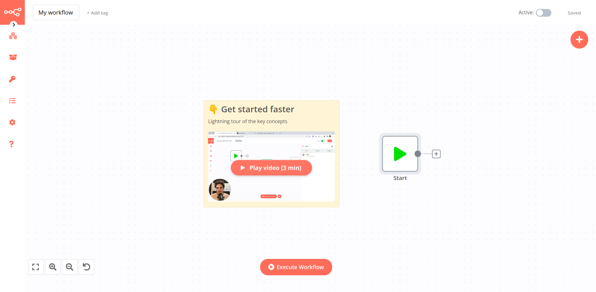
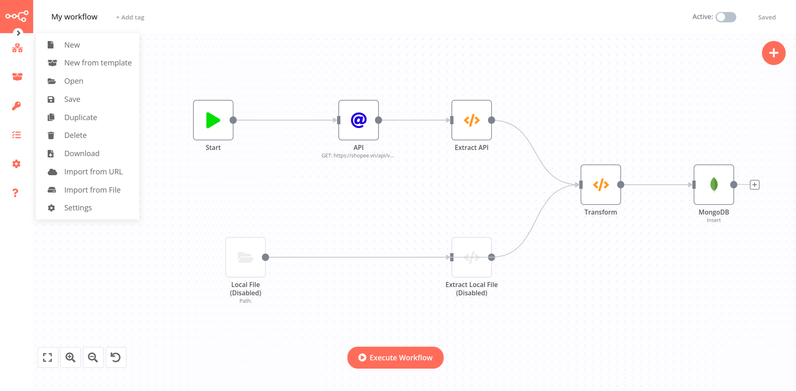
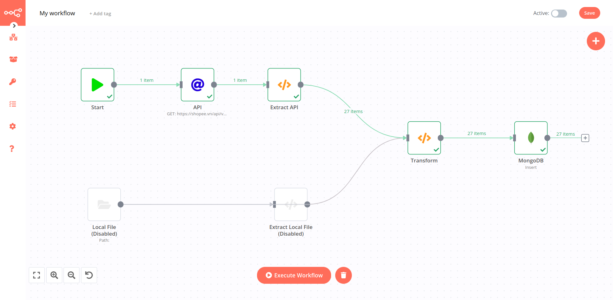
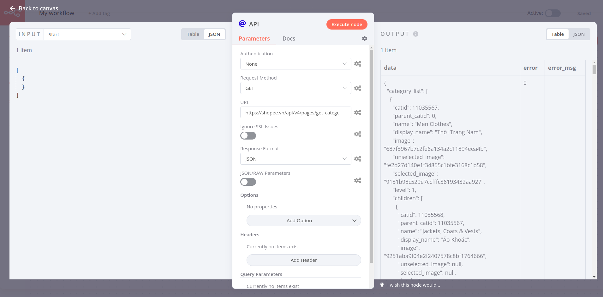
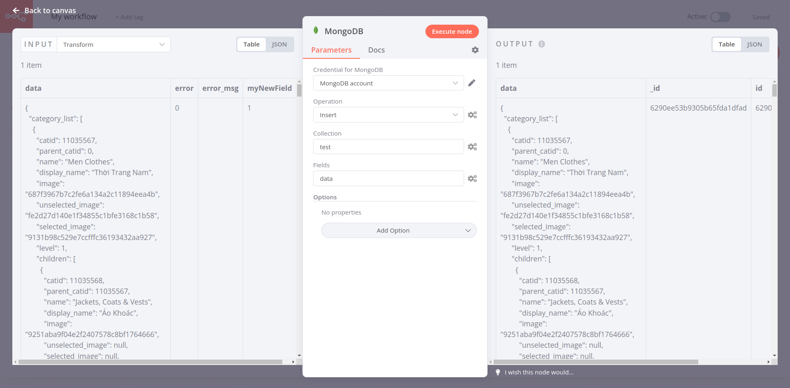

# n8n - Workflow Automation Tool

n8n (tên đầy đủ là "node-mation") là một công cụ giúp tự động hóa các quy trình, kết nối các công việc thành một chuỗi (gọi là workflows). Workflows có thể được chạy tự động, lặp đi lặp lại mỗi tuần, mỗi ngày, mỗi giờ, hoặc dựa theo một sự kiện đã được cài đặt, giúp người sử dụng tiết kiệm được rất nhiều thời gian và công sức.

## Cài đặt

Có thể cài đặt n8n bằng 1 trong 3 cách sau:

- Cài đặt ứng dụng desktop (Windows, MacOS):
  - https://n8n.io/
     
- Cài đặt bằng NodeJS:
  - Sử dụng npx: `npx n8n`
  - Sử dụng npm: `npm install -g n8n && n8n`
  - Sử dụng yarn: `yarn global add n8n && n8n`
     
- Cài đặt bằng Docker:
  - `docker run -it --rm --name n8n -p 5678:5678 n8nio/n8n`

Sau khi cài đặt xong, mở ứng dụng desktop hoặc truy cập vào trình duyệt tại địa chỉ: http://localhost:5678

Chọn biểu tượng Workflow -> Open -> Chọn file My_workflow.json hoặc copy (Ctrl+C) nội dung file My_workflow.json và dán (Ctrl+V) tại giao diện chính:

## Sử dụng
Nhấn Excute Workflow để chạy thử

Kết quả thu được: Dữ liệu về danh sách các loại sản phẩm được đọc từ API và ghi vào trong MongoDB

